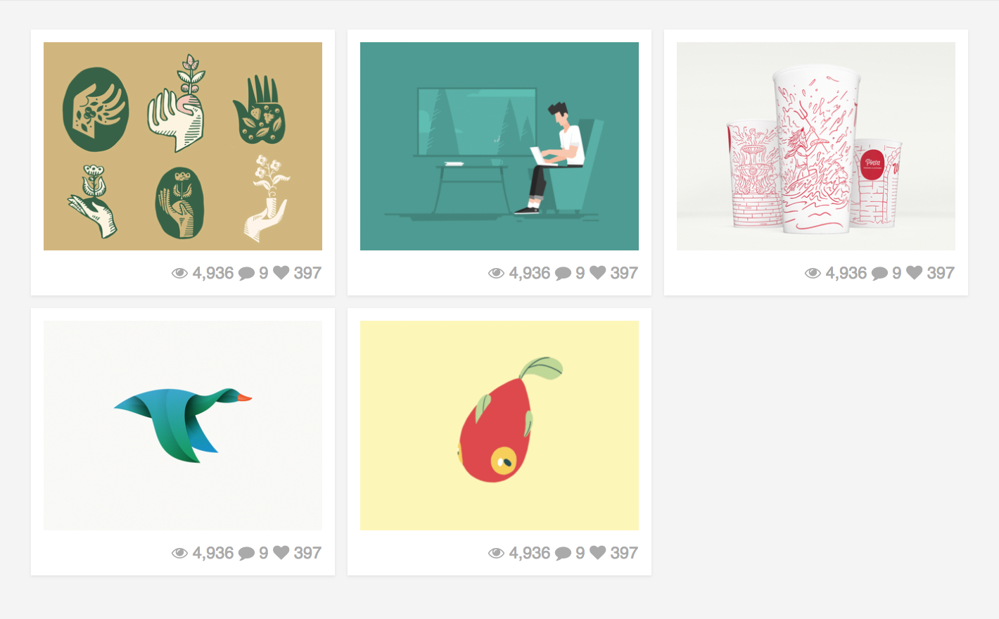

# Dribbble

## Steps
- Create a GitHub repository called `activity--dribbble`.
- Install `Sass` in your local project.
- Add Font Awesome link to use icons from library.

## Design Specs

```
General
  background color: F4F4F4
Item
  dimension: 220 * auto
  space between content and border: 10px
Icons
  color: AAA
  text size: 13px
  fa-eye
  fa-comment
  fa-heart
Images
  1. https://cdn.dribbble.com/users/2060/screenshots/4222535/hands_tadcarpenter_1x.jpg
  2. https://cdn.dribbble.com/users/1056629/screenshots/4222850/buildbunker_01_1x.gif
  3. https://cdn.dribbble.com/users/136981/screenshots/4222301/pinsa-dribbble_1x.jpg
  4. https://cdn.dribbble.com/users/947358/screenshots/4221041/duck2_1x.png
  5. https://cdn.dribbble.com/users/948033/screenshots/4222156/gifstoryboard_fish_v03_1x.gif
```

## Extra help

Ask Google how to add a shadow with CSS to items. And use the next values:
- 0px for horizontal
- 1px for vertical
- 2px for blur
- rgba(0, 0, 0, 0.07) for shadow color

## Final Result


